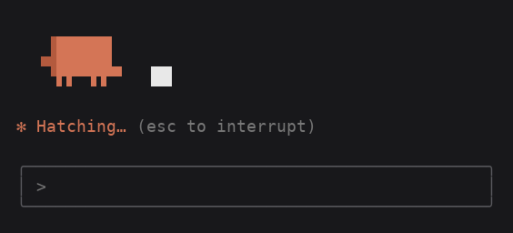

# clawd-actor

A Claude Code mod: while Claude works, **Clawd** walks onto a little stage above the prompt and
acts out what is going on — the spinner's `-ing` word (*Sautéing*, *Pondering*, *Herding*…) and
whatever tool is running right now.



*Eight scenes at the real frame rate, each cut to a few seconds (a real turn changes scene every 30 s). Every frame is the mod's own output, rendered by `tools/`.*

## What it does

- **Acts out the spinner word.** 29 scenes, matched by word stem, so *Flambéing* cooks and
  *Dilly-dallying* strolls. A word it does not know falls back to what the turn is doing
  (typing for tool use, talking while responding, thinking otherwise).
- **Acts out the running tool.** `Bash` types, `Read`/`Grep`/`Glob` think, `Edit`/`Write` sketch,
  `Agent` herds sheep, `Web*` checks the weather, `TodoWrite`/`Skill` juggles, MCP tools cast
  spells, anything else is hammered at the forge. When the tool returns, the show goes on.
- **Changes scene every 30 seconds** on long turns, in an order shuffled per turn, never the same
  scene twice in a row.
- **Wanders the stage.** Clawd strolls left and right with its props, swinging arms and legs,
  hopping at each turn and landing with a squash; the stage follows the terminal width (up to
  60 columns). At the blackboard the board stays put and Clawd steps back to admire its work. By the
  campfire it sits still with a purple friend, and only the fire and their eyes move.
- **Has a face.** Happy ^ ^ eyes, blinks, glances around, and sways so its far side falls into
  shadow, after the official Clawd animation; on the move it looks where it is going.
- **Leaves when the turn ends**, and draws nothing while idle (the frame timer only redraws
  during a turn).

| Scene | Spinner words (some of them) |
| --- | --- |
| think | Pondering, Musing, Clauding, Noodling, Ruminating |
| chalk | Deciphering, Elucidating, Philosophising, Deliberating, Reasoning |
| cook / bake / brew | Sautéing, Simmering, Whisking / Baking, Kneading / Brewing, Percolating |
| walk / run / moonwalk | Moseying, Wandering / Scampering, Galloping / Moonwalking |
| herd | Herding, Wrangling, Mustering |
| spin | Spinning, Churning, Reticulating, Combobulating |
| magic / levitate | Conjuring, Manifesting, Transmuting / Levitating, Hyperspacing |
| hatch / grow | Hatching, Incubating / Sprouting, Germinating |
| forge / compute | Forging, Crafting, Creating / Computing, Crunching, Synthesizing |
| dance / juggle / honk | Vibing, Grooving, Boogieing / Juggling / Honking, Booping |
| sketch / weather / thunder | Sketching, Doodling / Misting, Billowing / Thundering |
| dig / flow | Burrowing, Spelunking / Flowing, Undulating |
| kick / skate / campfire | Kicking, Dribbling / Skating, Gliding / Kindling, Smoldering — no built-in word matches these yet, so they mostly turn up in the rotation |

## Install

Requires a Claude Code build with function-hook mods (`claude plugin validate` knows `hooks.json`
`modules`). Developed and tested on Claude Code 2.1.289.

From this repository as a marketplace:

```
/plugin marketplace add BrianHuang813/clawd-actor
/plugin install clawd-actor@clawd-actor
/reload-plugins
```

Or straight from a clone, for one session:

```sh
git clone https://github.com/BrianHuang813/clawd-actor
claude --plugin-dir ./clawd-actor
```

## Plays well with other band mods

The stage is drawn in the `AbovePrompt` band. The hook always calls `next(e)` and stacks what the
mods beneath it draw under the stage, so other band mods keep showing. A band mod that answers
without calling `next(e)` hides everything beneath it — if Clawd never shows up, look for one.

## How it works

- `ui.render` on `Spinner` only *observes*: it remembers the word and mode and lets the engine draw
  the spinner as usual.
- `tool.call` notes the tool in flight and forgets it when the call returns.
- One timer, started in `session.start`, advances a frame counter in `$.state` every 140 ms while a
  turn runs; the band reads it, which subscribes it to redraws. A timer started inside a
  `turn.start` hook does not outlive that dispatch, which is why it lives in `session.start`.
- Whether to draw at all follows the band's own `isWorking` prop.
- `hooks/scenes.ts` is pure: a 4-row grid of cells, a scene per name, `sceneAt()` choosing the
  scene for a frame and `frameRows()` turning the grid into coloured runs.

## Develop

```sh
claude plugin validate .
claude plugin test .
```

The tests check that every scene keeps the stage size at 30, 40 and 60 columns and moves Clawd
about (the campfire, where it sits still, is checked to stay put), that a turn opens on the spinner word and then rotates through every other scene, that a
running tool takes over, and that the timer animates Clawd during a turn and lets go after it.

Block characters and symbols are drawn one cell wide; a terminal font that draws some of them
wider may shift a frame.

To regenerate `assets/demo.gif` after changing a scene (Node 22+ and Python with Pillow):

```sh
node tools/frames.ts > frames.json      # the frames, straight from hooks/scenes.ts
python tools/render.py frames.json assets/demo.gif
```

`tools/render.py` uses DejaVu Sans Mono and draws block elements as exact rectangles; edit the
font path at its top for your system.

## Notes

Clawd is Claude Code's mascot; the sprite follows the one on Claude Code's welcome screen. This is
a fan-made mod, not affiliated with or endorsed by Anthropic.
